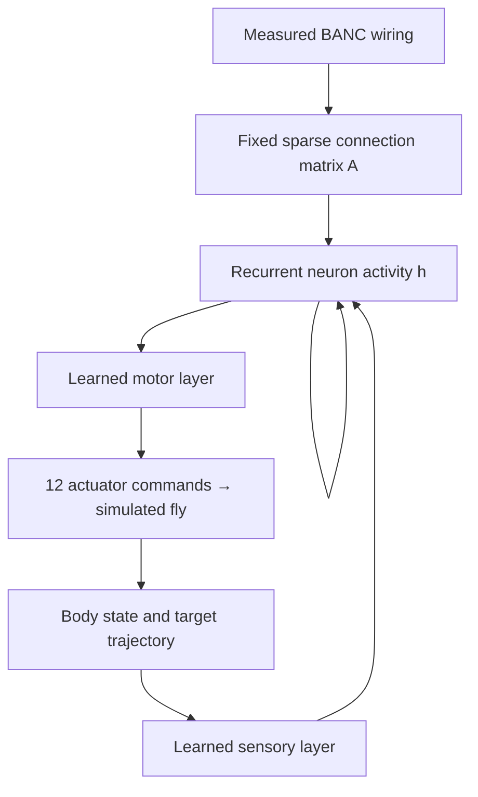
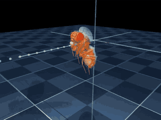

# SuperFly — teach a connectome to control a fly

**We turn measured fruit-fly neural wiring into a recurrent neural network, train it to imitate a flight expert, and test whether it can fly a simulated body by itself.**

A **connectome** is a directed, weighted graph: neurons are nodes; connections between neurons are edges. We use a small subgraph of **BANC v888**, a measured fly brain-and-nerve-cord connectome.

## How it works



Think of the connectome as the network's **internal wiring diagram**. We keep that wiring fixed and learn how to feed information into it and turn its activity into motor commands.

| Component | What it does | Trained? |
| --- | --- | --- |
| BANC graph | Routes activity between selected neurons | **Fixed** |
| Sensory layer | Maps observations into neuron inputs | Yes |
| Neuron dynamics | Controls how activity changes and persists | Yes |
| Motor layer | Turns activity into 12 actuator commands | Yes |
| Flybody simulator | Computes wing motion and body physics | Fixed |

Our committed student uses **256 neurons and 1,949 directed edges**, followed by a learned **128-unit nonlinear motor readout**. In CS terms, it is a small RNN whose recurrent matrix comes from measured wiring.

Each step combines new sensory input with `A @ h`, applies `tanh`, and blends that result with the previous activity. The motor layer reads this updated activity. Learned gain and leak parameters control the strength of recurrence and how quickly state changes. The controller acts every **0.2 ms**.

## How it learns

1. **Watch an expert.** Run the released Flybody controller and record observations plus its 12 motor commands.
2. **Imitate.** Train the student to predict those commands. Gradients update the sensory layer, neuron dynamics and motor layer; the BANC matrix stays fixed.
3. **Learn from its mistakes.** Let the student influence the fly, ask the expert what it would do in the states reached, and add those examples to training. This is **DAgger**, or dataset aggregation.
4. **Fly alone.** Evaluate the student without expert actions and score actual flight.

Optional PPO-style reinforcement fine-tuning and a shuffled-wiring control are implemented. The committed corrective student used **no RL fine-tuning**.

## What works today

[](media/connectome-flight.mp4)

**[Play connectome flight](media/connectome-flight.mp4)** · [First test episode (failure)](media/nonlinear-first-seed.mp4) · [Expert teacher](media/expert-flight.mp4)

The animation shows **our connectome student flying without expert assistance**. It is an explicitly selected successful example, seed **80001**, from the 5/10 test result below. Its replay exactly matches the recorded episode metrics. Movies run at **10× slow motion**; orange is the controlled fly and translucent is the target. [Recording provenance](results/2026-09-13-connectome-example/).

| Controller | Flights passing the gate | Mean duration | Mean tracking error |
| --- | ---: | ---: | ---: |
| Released Flybody expert | **10/10** | 598.8 ms | 0.0269 cm |
| Connectome student, nonlinear readout | **5/10** | 361.34 ms | 0.1121 cm |
| Earlier linear readout | 0/10 | 100.92 ms | 0.2110 cm |

**The connectome student now completes five of ten held-out flights without expert assistance.** The 90% acceptance gate remains unmet. Three validation flights passed; the larger held-out test exposed failures on other initial phases. The separate first-test-episode movie shows a failure; the score includes all ten episodes.

The task starts airborne and follows a straight trajectory at 20 cm/s. The gate requires at least 10 episodes, with at least 90% completing ≥0.59 s and averaging ≤0.1 cm position error. These runs use different seeds; the table is descriptive. Some seeds map to the same initial wingbeat phase.

## Run the connectome student

Linux / Python 3.11 / CPU / headless EGL:

```bash
sudo apt-get update
sudo apt-get install -y libegl1-mesa libgl1-mesa-dri ffmpeg
uv venv --python 3.11
source .venv/bin/activate
uv pip install torch==2.5.1 --index-url https://download.pytorch.org/whl/cpu
uv pip install -e '.[superfly,dev]'
export MUJOCO_GL=egl

superfly evaluate \
  --graph results/2026-09-13-nonlinear/graph.npz \
  --checkpoint results/2026-09-13-nonlinear/student.pt \
  --episodes 10 --seed 80000 --video --output runs/student
fly assess runs/student/metrics.json
```

This replays the committed 5/10 candidate. New checkpoints record neuron IDs; loading checks wiring and provenance before applying weights. Legacy checkpoints, including this one, lack explicit neuron IDs and receive wiring/provenance checks.

**[Training commands and expert demo →](docs/experiments.md)** · [Autonomous checkpoint selection](docs/autonomous-training.md)

## What the biology contributes

BANC supplies measured connectivity and positive input-normalized edge weights. We select a small subgraph using motor/descending/flight-related annotations. Sensory encoding, neural dynamics and motor decoding are learned engineering choices; neurotransmitter signs are not modeled.

We have not shown that biological wiring beats shuffled wiring. The implemented control rewires edges while preserving each node's incoming/outgoing degree and the edge-weight multiset. That comparison is needed before claiming an advantage from the connectome. Takeoff, maneuvering and disturbance recovery also remain unvalidated.

## Evidence and credit

[Latest student checkpoint, graph, training and scores](results/2026-09-13-nonlinear/) · [Linear-readout experiment](results/2026-09-13-autonomous/) · [Original student](results/2026-09-12-superfly/) · [Expert scores](results/2026-09-12-expert/) · [Media provenance](media/provenance.json)

```bash
python scripts/verify_flight_release.py
pytest -q
```

The verifier checks saved assessments against raw metrics and checks file hashes. Historical results retain their exact source commit; later code fixes do not retroactively change them.

Built on [Flybody](https://github.com/TuragaLab/flybody) by HHMI Janelia and Google DeepMind, using their released pretrained expert. Sources: [Flybody paper](https://doi.org/10.1038/s41586-025-09029-4), [BANC paper](https://doi.org/10.1038/s41586-026-10735-w), [BANC data](https://doi.org/10.7910/DVN/7WTH1N).
