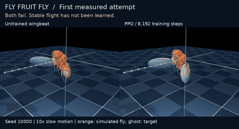

# fly-fruit-fly

**A real MuJoCo flight-learning experiment. Stable flight is not achieved yet.**

A small PPO controller learns corrections to [Flybody](https://github.com/TuragaLab/flybody)'s
wingbeat generator. This repository contains the code, the first trained checkpoint,
raw measurements, and actual simulator videos—including the failures.
It does **not** contain a fruit-fly connectome or a reconstructed biological brain.

[](media/comparison.mp4)

**[Watch/download the comparison movie](media/comparison.mp4)** ·
[Unedited baseline](media/baseline.mp4) · [Unedited PPO attempt](media/ppo-8192.mp4)

The movie shows evaluation seed **10000**, selected as the first episode rather
than the best episode. Orange is the simulated fly; the translucent ghost is the
target. Motion is approximately **10× slower than simulated time**. Each panel
holds its last frame after termination, explicitly labeled; the hold is not
additional flight. There is no generated flight footage.

The animation plays directly in the README. Click it for the full MP4; if GitHub
shows a file page instead of a player, choose **View raw / Download**. Mobile apps
may pause GIF autoplay; the MP4 link remains available.

## Sustained flight: the next model milestone

The **Sustained flight experiment** workflow continues the recorded checkpoint for
65,536 additional steps, then evaluates ten new, matched initial wingbeat phases.
It uses explicit `gamma=0.999` and `gae_lambda=0.99` overrides to test longer-horizon
credit assignment. These are experimental settings, not demonstrated improvements.
At the 0.2 ms control interval, `gamma=0.999` gives an approximate 0.2-second
discount horizon, compared with ~0.02 seconds for `0.99`.

The task gate requires **at least ten episodes**, with **90%** completing at least
**0.59 seconds** and each passing episode averaging at most **0.1 cm** position
error. This is a declared engineering milestone for the straight-flight task,
not a claim of takeoff, maneuverability, robustness, or biological fidelity.

```bash
fly train --resume results/2026-09-12-smoke --steps 65536 --gamma 0.999 --gae-lambda 0.99 --output runs/candidate
fly evaluate --checkpoint runs/candidate --episodes 10 --seed 20000 --video --output runs/candidate-eval
fly assess runs/candidate-eval/metrics.json --require-pass
```

`assess --require-pass` exits **2** when the gate fails. Without that flag, it
reports the result without failing the command. A green experiment workflow means
the experiment ran; its `assessment.json` states whether flight passed. Models
are never silently promoted on reward alone. Each evaluation now also saves
`trajectory.csv` for time-aligned error analysis. Existing output directories are
protected from accidental overwrite. Assessment rejects malformed metrics,
non-finite values, duplicate seeds, and mismatched comparison configurations.

## What we verified

[Run 34698143882](https://github.com/zozo123/fly-fruit-fly/actions/runs/34698143882)
completed on **2026-09-12**, using source commit
[`54b60a0`](https://github.com/zozo123/fly-fruit-fly/tree/54b60a0f05d3b7821365897a6e8410080b2c6bf2).
Five simulator tests passed. The run trained for 8,192 steps, saved the model and
normalization statistics, reloaded them, evaluated three held-out initial wingbeat
phases, and produced both videos. **Passing CI confirms that pipeline; it does not
mean the fly learned to fly.**

| Measurement | Untrained wingbeat | PPO after 8,192 steps |
| --- | ---: | ---: |
| Completed reference | 0 / 3 | 0 / 3 |
| Failed episodes | 3 / 3 | 3 / 3 |
| Mean episode duration | 53.27 ms | 62.07 ms |
| Mean episode return | 97.11 | 106.76 |
| Mean tracking error¹ | 0.289 cm | 0.388 cm |

¹ Mean of each episode's mean position error, over its own duration. The episodes
have different lengths; this is not a matched-time error comparison.

**Interpretation:** episodes lasted 16.5% longer and return increased, but average
tracking error worsened and every attempt failed well before the ~0.6-second goal.
This is one short training run with one training seed and three evaluation phases.
It does not establish reliable improvement, successful hovering, takeoff, or general flight.

## Evidence you can inspect

The original results are committed here, so they do not depend on expiring Actions
artifacts: [baseline JSON](results/2026-09-12-smoke/baseline.json),
[PPO JSON](results/2026-09-12-smoke/ppo.json),
[training configuration](results/2026-09-12-smoke/training.json),
[installed environment](results/2026-09-12-smoke/environment.txt),
[provenance and file hashes](results/2026-09-12-smoke/provenance.json).
The original downloaded artifact's SHA-256 matched GitHub's recorded digest before
these files were extracted. The movies were decoded and inspected.

Check the committed evidence without installing a simulator:

```bash
python scripts/verify_results.py
```

After installing the project, replay the saved controller:

```bash
fly evaluate --checkpoint results/2026-09-12-smoke --episodes 3 --video --output runs/replay
```

The checkpoint and its matching statistics are included. Exact numeric replay
can vary across platforms and dependency versions; the recorded environment is
provided, and this publication does not claim an independent second training run.
To reproduce the annotated movie from the raw videos on Linux, install Pillow
and FFmpeg, then run `python scripts/make_movie.py`.

## Run

Use Python 3.11 on Linux for the tested CI configuration. Python 3.12 is also
allowed but not covered by CI. From a checkout of this repository:

```bash
uv venv --python 3.11
source .venv/bin/activate
uv pip install -e '.[dev]'
export MUJOCO_GL=egl

# Measure the existing wingbeat generator with no learned corrections.
fly evaluate --episodes 5 --video --output runs/baseline

# Train the small controller. This is a starting budget, not a success guarantee.
fly train --steps 1000000 --output runs/train

# Reload policy AND observation statistics; use the same evaluation seeds.
fly evaluate --checkpoint runs/train --episodes 5 --video --output runs/evaluation
```

`python -m pip install -e '.[dev]'` works instead of `uv pip install` in an
activated Python environment. For CPU-only Torch, install its CPU wheel first as
shown in the workflow. On headless Ubuntu, install `libegl1-mesa`,
`libgl1-mesa-dri`, and `ffmpeg`. On a desktop, omit the EGL setting if the normal
MuJoCo renderer works. Training itself does not capture video.

## Continue training the saved model

```bash
fly train --resume results/2026-09-12-smoke --steps 100000 --output runs/continued
fly evaluate --checkpoint runs/continued --episodes 5 --video --output runs/continued-evaluation
```

`--steps` is the **additional** budget when resuming, rounded up to a complete
rollout. We restore weights, optimizer, step counters, and observation/reward
normalization. Training starts a fresh seeded episode; this is not a bit-exact
continuation of simulator or random-number state. Use a new empty output directory
to preserve the source checkpoint. `training.json` records the starting and added
step counts. `--checkpoint-every 10240` controls periodic checkpoint frequency.
Periodic files use SB3's names: `rl_model_N_steps.zip` and
`rl_model_vecnormalize_N_steps.pkl`. To resume one, copy the matching pair into a
new directory as `policy.zip` and `normalize.pkl`.

The integration workflow also resumes training for 512 steps, checks the cumulative
counter and changed policy weights, verifies normalization counts continue, and
loads the resumed model for an evaluation episode.

## No local setup: GitHub Actions

Open [Actions → Flight baseline](https://github.com/zozo123/fly-fruit-fly/actions/workflows/flight.yml).
Each push runs simulator tests, measures the untrained controller, trains for
8,192 steps, reloads the saved model, and renders an evaluation. This is a smoke
budget, not enough to assume convergence. For a longer experiment, choose
**Run workflow** and enter the training budget. The job has a 60-minute cap;
checkpoints and normalization statistics are saved every 10,240 steps and
uploaded even if a later step fails. Runs consume GitHub Actions minutes.

Download the run's `flight-baseline-…` artifact to get:

| File | Purpose |
| --- | --- |
| `baseline/metrics.json` | Untrained wingbeat reference score |
| `baseline/flight.mp4` | First untrained episode, including any crash |
| `train/policy.zip` | Trained PPO model |
| `train/normalize.pkl` | Matching observation normalization; keep with model |
| `train/training.json` | Seed and actual training steps |
| `evaluation/metrics.json` | Held-out episode scores, durations, errors, failures |
| `evaluation/flight.mp4` | First evaluation episode, including any crash |
| `environment.txt` | Exact installed dependency versions |

Videos show the real simulator at **10× slow motion**. The translucent ghost is
the target trajectory, not the learned fly. Files are written under `runs/`
locally; workflow artifacts expire after 14 days, so download runs you want to keep.
Only load trusted model/normalization files.

## What the experiment means

- Target: approximately 0.6 seconds at **20 cm/s**, **1 cm** initial CoM height.
  The fly starts airborne at the target velocity; takeoff is not trained.
- Flybody's units are centimeters, grams, and seconds. Its stock synthetic
  reference lasts only 40 ms; this project supplies a full-length reference.
- Physics and aerodynamic forces come from Flybody/MuJoCo. The wingbeat
  generator supplies a periodic baseline; PPO learns residual actions.
- Rewards are Flybody's existing position/orientation tracking and leg terms.
  Crashes terminate episodes; reference/time limits truncate them so PPO can
  bootstrap correctly.
- Observations are flattened in stable key order and normalized. The tiny
  two-layer, 64-unit policy runs on CPU. This PPO path is our baseline, not the
  upstream paper's DMPO training reproduction.
- Compare completion rate, mean return, and per-episode tracking error against
  the untrained baseline on the same held-out seeds. Seeds vary initial wingbeat
  phase; they do not represent diverse environments. Longer survival alone
  does not establish accurate flight. Repeat training across seeds before
  claiming a reliable improvement.

## Connectome: next controlled experiment

Once the flight baseline works, collect observation/action pairs from its
controller. Fit an input adapter and readout around a fixed, sparse connectome
network, first by imitation and then optionally by reinforcement learning.
Compare against the PPO teacher and a size-matched random reservoir on unseen
trajectories and disturbances. Measure whether the real wiring helps.

Wiring counts alone do not specify synaptic signs, neuron dynamics, sensory
encoding, or motor decoding. Keep those modeling assumptions explicit. Do not
download gigabytes of connectome data until the embodied baseline is measured.

## Sources and attribution

Flybody is developed by HHMI Janelia and Google DeepMind and distributed under
Apache-2.0. We depend on the upstream project pinned to commit
`d015e9bfe441bd90ae431bac24c55cb74bdbce26`; its body assets remain upstream.
See [Whole-body physics simulation of fruit fly locomotion (Nature, 2025)](
https://doi.org/10.1038/s41586-025-09029-4).

Relevant upstream code: [flight environments](https://github.com/TuragaLab/flybody/blob/d015e9bfe441bd90ae431bac24c55cb74bdbce26/flybody/fly_envs.py),
[flight task](https://github.com/TuragaLab/flybody/blob/d015e9bfe441bd90ae431bac24c55cb74bdbce26/flybody/tasks/flight_imitation.py),
[synthetic trajectory](https://github.com/TuragaLab/flybody/blob/d015e9bfe441bd90ae431bac24c55cb74bdbce26/flybody/tasks/synthetic_trajectories.py).
