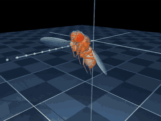
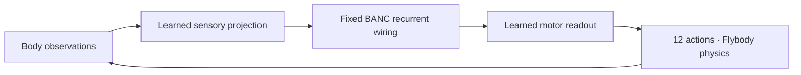

# SuperFly · fly-fruit-fly

**A working simulated flight demo, with an experimental controller built on measured fruit-fly wiring.**

The released [Flybody](https://github.com/TuragaLab/flybody) expert passes **10/10 straight flights**: **0.5988 s** each, **0.0269 cm** mean tracking error. SuperFly learns from that expert through a fixed sparse BANC connectome; its current autonomous student passes **0/10**. Both results are recorded below.

[](media/expert-flight.mp4)

**[Play the flight movie](media/expert-flight.mp4)** · [Student movie](media/superfly-student.mp4) · [Verified expert run](https://github.com/zozo123/fly-fruit-fly/actions/runs/34717099451)

The animation plays directly in this README. Click it for the MP4. These are actual MuJoCo frames from the first evaluation episode: orange is the controlled fly, translucent is the reference. Playback is **10× slower than simulation**; the six-second movie represents about 0.6 seconds of flight.

## Run the working flight demo

Tested on Ubuntu 22.04, Python 3.11, CPU, headless EGL. Start in a clone of this repository.

```bash
sudo apt-get update
sudo apt-get install -y libegl1-mesa libgl1-mesa-dri ffmpeg
uv venv --python 3.11
source .venv/bin/activate
uv pip install torch==2.5.1 --index-url https://download.pytorch.org/whl/cpu
uv pip install -e '.[expert,dev]'
export MUJOCO_GL=egl

fly evaluate --expert --episodes 10 --seed 40000 --video --output runs/expert
fly assess runs/expert/metrics.json --require-pass
```

Open `runs/expert/flight.mp4`. The command downloads the released expert (about 6.5 MB) and retrieves the small official FMech wing-pattern member using HTTP ranges. No connectome download is needed for this demo. The expert archive is SHA-256 pinned; wing-pattern provenance records its SHA-256 and ZIP-member CRC, without claiming verification of the entire dataset archive.

## What is verified

| Controller | Passing episodes | Mean flight duration | Mean episode tracking error |
| --- | ---: | ---: | ---: |
| Released Flybody expert | **10/10** | **598.8 ms** | **0.0269 cm** |
| SuperFly BANC student, corrective imitation | 0/10 | 83.24 ms | 0.3281 cm |
| Earlier PPO, 73,728 total steps | 0/10 | 72.44 ms | 0.394 cm |

These are separate experiments with different evaluation seeds and, for the earlier PPO, a different wing pattern. The table is descriptive; it does not establish a paired improvement or an advantage from biological wiring.

The fixed gate requires at least 10 episodes and a 90% pass rate. A passing episode completes the reference, lasts at least 0.59 s, and averages at most 0.1 cm target-position error. Reward alone cannot pass the gate. `--require-pass` exits 2 on failure.

The target is airborne straight flight at 20 cm/s, starting at 1 cm height. Evaluation varies initial wingbeat phase; some seeds produce the same discrete phase. This establishes performance on this task only. Takeoff, hovering, maneuvers, disturbances, and general flight remain unvalidated.

## The SuperFly model

SuperFly uses a selected subgraph of **BANC v888 measured neuron-to-neuron connectivity** as a fixed sparse recurrent matrix. The committed student has **256 nodes and 1,949 directed edges**.



Sensory projection, recurrent gain, node leak/bias, and motor/value readouts are trainable. The measured adjacency is a buffer. Positive input-normalized edge weights are used as an engineering structural prior; neurotransmitter signs and biological neural dynamics are not reconstructed.

Training collects expert demonstrations, fits native actuator actions with truncated backpropagation, then adds DAgger corrective labels on states visited by mixed teacher/student control. Optional PPO-style fine-tuning uses stored recurrent states for one-step updates. A directed degree-preserving shuffled graph is available as a control; no completed comparison establishes that measured wiring helps.

The current corrective run used two teacher episodes and three DAgger rounds, with **zero RL fine-tuning steps**. Teacher-assisted rollouts completed, but autonomous evaluation failed. Lower imitation loss alone did not establish flight.

## Replay the committed student

```bash
uv pip install -e '.[superfly,dev]'
superfly evaluate \
  --graph results/2026-09-12-superfly/banc-v888-superfly.npz \
  --checkpoint results/2026-09-12-superfly/superfly.pt \
  --episodes 10 --seed 51234 --video --output runs/student-replay
fly assess runs/student-replay/metrics.json
```

The checkpoint includes learned parameters and observation normalization. Keep it with its matching graph. It is a failed research candidate, ready for inspection and continued experimentation.

## Train a new student

This path additionally downloads BANC metadata and the neuron edgelist, and materializes the selected subgraph with source/version/hash provenance.

```bash
python -m fly_fruit_fly.curriculum \
  --nodes 256 --min-synapses 5 \
  --teacher-episodes 2 --distill-epochs 6 --bptt-steps 64 \
  --dagger-rounds 3 --dagger-episodes 1 --dagger-epochs 2 \
  --dagger-start-beta 0.8 --dagger-end-beta 0.0 \
  --rl-steps 0 --eval-episodes 10 --seed 1234 --video \
  --output runs/superfly-corrective
fly assess runs/superfly-corrective/evaluation/metrics.json --require-pass
```

Use a fresh output directory for each experiment. Add `--shuffled` for the wiring control. The historical candidate predates fixes that seed parameter initialization and bootstrap time-limit value estimates; fresh training is not expected to reproduce its weights exactly. No new flight-performance claim is made for those fixes.

[SuperFly workflow](.github/workflows/superfly.yml) also supports a manually dispatched real-versus-shuffled training experiment. Workflow completion means the experiment ran; inspect its flight metrics before promoting a model.

## Evidence and verification

- [Expert metrics, assessment, environment and provenance](results/2026-09-12-expert/)
- [Student metrics, assessment, training, checkpoint, graph and provenance](results/2026-09-12-superfly/)
- [Student training run and full artifact](https://github.com/zozo123/fly-fruit-fly/actions/runs/34721888010) — includes corrective dataset and trajectory trace; Actions artifacts have limited retention.
- [Earlier PPO evidence](results/2026-09-12-sustained/) · [Original smoke checkpoint](results/2026-09-12-smoke/) · [Earlier failure movie](media/comparison.mp4)
- [Media checksums and recording provenance](media/provenance.json)

Verify the committed reports and file hashes without installing the simulator:

```bash
python scripts/verify_flight_release.py
python scripts/verify_results.py
```

Run code and simulator tests with `pytest -q`. Evidence retains the exact source commit and original artifact SHA-256. Videos illustrate behavior; metrics determine the gate.

## Sources and credit

Flybody is developed by HHMI Janelia and Google DeepMind and distributed under Apache-2.0. The successful controller is their released pretrained expert. This project supplies integration, evaluation, and experimental student training.

- [Pinned Flybody source](https://github.com/TuragaLab/flybody/tree/d015e9bfe441bd90ae431bac24c55cb74bdbce26)
- [Whole-body physics simulation of fruit fly locomotion](https://doi.org/10.1038/s41586-025-09029-4)
- [Released Flybody assets](https://janelia.figshare.com/articles/dataset/25309105)
- [BANC paper](https://doi.org/10.1038/s41586-026-10735-w) · [BANC static data](https://doi.org/10.7910/DVN/7WTH1N)

